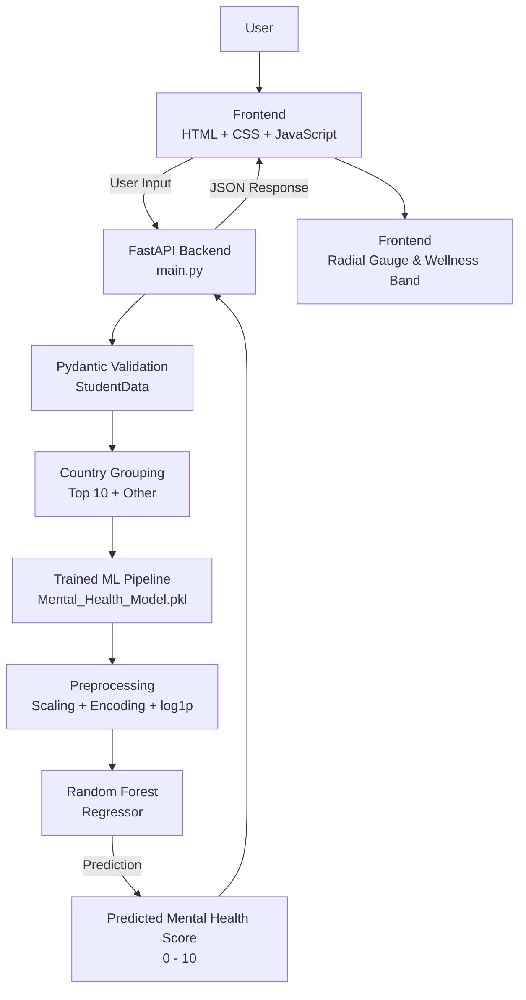

# 🎓 Student Mental Health Score Prediction System

[](https://www.python.org/)
[](https://fastapi.tiangolo.com/)
[](https://scikit-learn.org/)
[](https://pandas.pydata.org/)
[](https://www.uvicorn.org/)
[](LICENSE)

An end-to-end Machine Learning web application that predicts a student's **Mental Health Score (0–10)** based on daily digital lifestyle habits, academic workload, sleep patterns, physical activity, and stress indicators.

The project pairs a trained **Random Forest regression pipeline** ($R^2 \approx 0.88\text{--}0.89$) with an asynchronous **FastAPI backend** and a modern, responsive web dashboard featuring an animated radial gauge score readout.

---

## 🌐 Live Demo

> 🔗 **Interactive Web App:** [Live Demo]( https://student-mental-health-score-prediction-w1do.onrender.com)  
---

## 📌 Table of Contents

- [Overview](#-overview)
- [System Architecture](#-system-architecture)
- [Key Features](#-key-features)
- [Dataset & Feature Engineering](#-dataset--feature-engineering)
- [Machine Learning Pipeline](#-machine-learning-pipeline)
- [Model Performance & Evaluation](#-model-performance--evaluation)
- [API Reference](#-api-reference)
- [Project Directory Structure](#-project-directory-structure)
- [Getting Started / Local Setup](#-getting-started--local-setup)
- [Usage Guide](#-usage-guide)
- [Deployment](#-deployment)
- [Disclaimer](#-disclaimer)
- [Author & Acknowledgments](#-author--acknowledgments)

---

## 💡 Overview

University and high school students face increasing digital distractions alongside demanding academic routines. This system analyzes behavioral signals—such as daily social media hours, phone unlock frequency, primary platform usage, study time, physical activity, and sleep—to compute a predicted **wellness indicator score** on a continuous scale from `0.0` (severe strain) to `10.0` (optimal resilience).

### Core Goals:
1. **Actionable Awareness:** Offer students insights into how habits like sleep and phone unlocks correlate with mental well-being.
2. **Leak-Free ML Pipeline:** Bundle categorical encoding, skewness rectification, standard scaling, and regression into an atomic Scikit-Learn `Pipeline`.
3. **Low-Latency Inference:** Serve predictions through high-performance FastAPI microservices validated with strict Pydantic schemas.

---
## 🏗️ System Architecture


## ✨ Key Features

- **Automated Preprocessing Pipeline:** Eliminates training-serving skew by integrating log transformation, scaling, ordinal encoding, and one-hot encoding within a single serialized `.pkl` artifact.
- **High Predictive Accuracy:** Random Forest model explains **~88–89% of the variance ($R^2 = 0.890$)** in mental health scores, outperforming linear baselines.
- **Robust Schema Validation:** Type-safety enforced using Pydantic models with numeric boundary checks (`ge=0`, `le=24`, `ge=10`, `le=100`) and literal enum restrictions.
- **High Cardinality Handling:** Raw country records (111 categories) are dynamically categorized into top 10 frequencies plus `'Other'` to prevent dimensional explosion.
- **Editorial UI / UX:**
  - Segmented stress controls with real-time field error highlights.
  - Interactive SVG radial gauge needle and gradient bar.
  - Interpreted wellness status bands:
    - **Strained:** `< 4.0` (elevated strain signal)
    - **Balanced:** `4.0 – 6.9` (steady routine with reset room)
    - **Strong:** `≥ 7.0` (resilient baseline)

---

## 📊 Dataset & Feature Engineering

The training dataset (`Student Social Media And Mental Health Impact.csv`) contains **5,000 observations** across 13 distinct attributes:

| Feature Name | Type | Description | Handling Strategy |
| :--- | :--- | :--- | :--- |
| `Age` | Integer | Student age (10–100) | `StandardScaler` |
| `Gender` | Categorical | `Male`, `Female` | `OneHotEncoder` |
| `Country` | Categorical | 111 raw countries | Grouped into top 10 + `Other`, then `OneHotEncoder` |
| `Academic_Level` | Categorical | `High School`, `Undergraduate`, `Graduate` | `OneHotEncoder` |
| `Most_Used_Platform` | Categorical | Facebook, Instagram, YouTube, TikTok, WhatsApp, etc. | `OneHotEncoder` |
| `Purpose_Of_Use` | Categorical | `Networking`, `Education`, `Entertainment`, `News` | `OneHotEncoder` |
| `Avg_Daily_Usage_Hours`| Float | Daily screen time on social media (0–24 hrs) | `StandardScaler` |
| `Daily_Unlocks` | Integer | Count of phone unlocks per day | `StandardScaler` |
| `Study_Hours` | Float | Dedicated study time per day (0–24 hrs) | Right-skewed: `FunctionTransformer(np.log1p)` + `StandardScaler` |
| `Physical_Activity_Hours`| Float | Exercise / sports time per day | Outliers clipped (`lower=0`) + `StandardScaler` |
| `Sleep_Hours_Per_Night`| Float | Average nightly sleep (0–24 hrs) | `StandardScaler` |
| `Stress_Level` | Ordinal | Perceived stress (`Low`, `Medium`, `High`, `Very High`) | `OrdinalEncoder` with preserved order |
| **`Mental_Health_Score`** | **Float** | **Target variable (Observed range: 3.6 to 9.4)** | Target output |

---

## ⚙️ Machine Learning Pipeline

The project follows a rigorous data science lifecycle structured in [`ML_Project.ipynb`](ML_Project.ipynb):

1. **Exploratory Data Analysis (EDA):** Analyzed correlations between screen habits, sleep deprivation, stress ratings, and overall scores.
2. **Data Cleaning:** Verified null values, removed zero-duplicate redundancies, and clipped invalid negative activity records to 0.
3. **Skewness Treatment:** Applied log transformation ($\log(1+x)$) on `Study_Hours` to normalize heavy right-skewed distributions.
4. **Scikit-Learn ColumnTransformer:**
   ```python
   preprocessor = ColumnTransformer(transformers=[
       ('Skewed_Pipeline', Pipeline([
           ('log_transform', FunctionTransformer(np.log1p)),
           ('scale', StandardScaler())
       ]), ['Study_Hours']),
       ('Plain_Numeric', StandardScaler(), [
           'Age', 'Avg_Daily_Usage_Hours', 'Daily_Unlocks',
           'Physical_Activity_Hours', 'Sleep_Hours_Per_Night'
       ]),
       ('Ordinal_Stress', OrdinalEncoder(categories=[['Low', 'Medium', 'High', 'Very High']]), ['Stress_Level']),
       ('Nominal_Categories', OneHotEncoder(handle_unknown='ignore', sparse_output=False), [
           'Gender', 'Academic_Level', 'Most_Used_Platform', 'Purpose_Of_Use', 'Grouped_country'
       ])
   ])
   ```
5. **Model Training & Hyperparameter Tuning:** Performed 5-fold cross-validation with `RandomizedSearchCV` exploring tree depth, leaf sample splits, and estimator counts.

---

## 📈 Model Performance & Evaluation

Models were evaluated on a dedicated, held-out test split (20% of data):

| Model | Test $R^2$ Score | Training $R^2$ Score | MAE (Score Points) | RMSE |
| :--- | :---: | :---: | :---: | :---: |
| **Linear Regression (Baseline)** | 0.745 | 0.732 | 0.536 | 0.670 |
| **Random Forest Regressor (Default)** | **0.890** | **0.982** | **0.326** | **0.439** |
| **Random Forest Regressor (Tuned)** | 0.878 | 0.958 | 0.347 | 0.463 |

> **Key Takeaway:** Random Forest captured non-linear interactions between sleep, physical activity, and stress levels significantly better than linear models, achieving an average error of only **~0.33 score points** on a 10-point scale.

---

## 🔌 API Reference

### 1. Health Check
- **Endpoint:** `GET /`
- **Response:**
  ```json
  ["Welcome to my new website "]
  ```

### 2. Predict Mental Health Score
- **Endpoint:** `POST /predict`
- **Content-Type:** `application/json`

#### Request Payload:
```json
{
  "age": 21,
  "gender": "Female",
  "country": "India",
  "academic_level": "Undergraduate",
  "most_used_platform": "Instagram",
  "purpose_of_use": "Entertainment",
  "avg_daily_usage_hours": 4.5,
  "daily_unlocks": 65,
  "study_hours": 5.0,
  "physical_activity_hours": 1.5,
  "sleep_hours_per_night": 7.0,
  "stress_level": "Medium"
}
```

#### Response:
```json
{
  "predicted_mental_health_score": 6.82
}
```

#### Example cURL Command:
```bash
curl -X POST "http://127.0.0.1:8000/predict" \
     -H "Content-Type: application/json" \
     -d '{
       "age": 21,
       "gender": "Female",
       "country": "India",
       "academic_level": "Undergraduate",
       "most_used_platform": "Instagram",
       "purpose_of_use": "Entertainment",
       "avg_daily_usage_hours": 4.5,
       "daily_unlocks": 65,
       "study_hours": 5.0,
       "physical_activity_hours": 1.5,
       "sleep_hours_per_night": 7.0,
       "stress_level": "Medium"
     }'
```

---

## 📁 Project Directory Structure

```text
Student-Mental-Health-Score-Prediction-System/
├── Student Social Media And Mental Health Impact.csv  # Dataset (5,000 records)
├── ML_Project.ipynb                                   # EDA, preprocessing & model development
├── Mental_Health_Model.pkl                            # Serialized scikit-learn pipeline
├── main.py                                            # FastAPI application & endpoints
├── requirements.txt                                   # Python package dependencies
├── index.html                                         # Responsive frontend UI
├── script.js                                          # Client logic, API fetch & gauge rendering
├── style.css                                          # Modern styling, animations & layout
└── README.md                                          # Project documentation
```

---

## 🚀 Getting Started / Local Setup

Follow these steps to run the complete system locally:

### 1. Prerequisites
- Python 3.9, 3.10, or 3.11 installed
- Git installed
- Any modern web browser

### 2. Clone the Repository
```bash
git clone https://github.com/Sakshi9335/Student-Mental-Health-Score-Prediction-System.git
cd Student-Mental-Health-Score-Prediction-System
```

### 3. Create & Activate a Virtual Environment
```bash
# Windows (PowerShell)
python -m venv venv
.\venv\Scripts\Activate.ps1

# macOS / Linux
python3 -m venv venv
source venv/bin/activate
```

### 4. Install Dependencies
```bash
pip install --upgrade pip
pip install -r requirements.txt
```

### 5. Start the FastAPI Server
```bash
uvicorn main:app --reload --port 8000
```
- The backend will be available at: `http://127.0.0.1:8000`
- Interactive API documentation will be available at: `http://127.0.0.1:8000/docs`

### 6. Launch the Frontend
You can launch the frontend by simply opening `index.html` in your browser, or using a lightweight HTTP server:
```bash
# In another terminal window:
python -m http.server 3000
```
Then navigate to `http://localhost:3000` in your web browser.

> **Note on Local API Target:** If running the backend locally on port 8000, ensure `API_BASE` in [`script.js`](script.js) points to `http://127.0.0.1:8000`:
> ```javascript
> const API_BASE = "http://127.0.0.1:8000";
> ```
> For cloud production, update it to your deployed Render URL.

---

## 💻 Usage Guide

1. **Enter Profile Data:** Fill in student age, gender, and country of residence.
2. **Specify Academic & Screen Habits:** Select study levels, primary social network, purpose, daily screen time, and phone unlock count.
3. **Log Lifestyle Metrics:** Input daily study hours, exercise/activity, nightly sleep, and select perceived stress level.
4. **Click "Read my signal":** The frontend sends a JSON payload to the model API.
5. **Analyze Result:** The animated radial gauge updates to show your predicted score ($0\text{--}10$) and wellness interpretation band.

---

## ☁️ Deployment

### Backend (FastAPI on Render / Railway / Hugging Face Spaces):
- **Build Command:** `pip install -r requirements.txt`
- **Start Command:** `uvicorn main:app --host 0.0.0.0 --port $PORT`

### Frontend (GitHub Pages / Vercel / Netlify):
- Host static files (`index.html`, `style.css`, `script.js`).
- Verify that CORS is enabled on the backend (`allow_origins=["*"]`).

---

## ⚠️ Disclaimer

> **Important:** This system is built strictly for **educational and informational purposes**. It provides a behavioral data-driven estimate based on statistical modeling and does **not** constitute medical advice, psychological counseling, or clinical diagnosis. If you or someone you know is experiencing mental health challenges, please reach out to licensed mental health professionals or student support counselors.

---

## 👤 Author & Acknowledgments

- **Author:** [Sakshi](https://github.com/Sakshi9335)
- **Repository:** [Student-Mental-Health-Score-Prediction-System](https://github.com/Sakshi9335/Student-Mental-Health-Score-Prediction-System)
- **Built with:** Scikit-Learn, FastAPI, Pandas, JavaScript, HTML5 & CSS3


